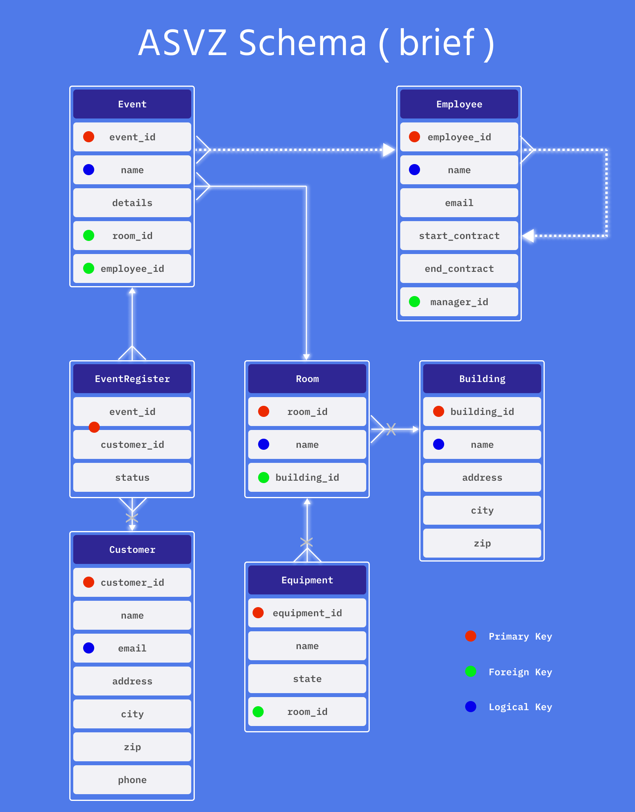
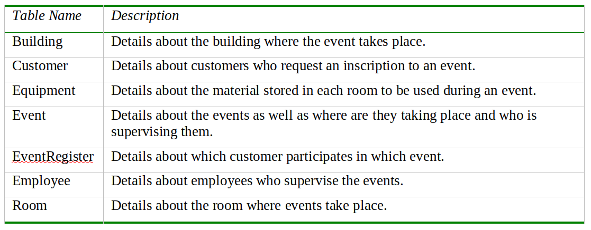

# ASVZ_Database_SQL
Akademische Sportverband Zürich Database simulation using both Oracle and PostgreSQL with Diagram and relationships creation.

  

  

    ASVZ Diagram.
  

# ASVZ - Akademische Sportverband Zürich
## Business Process Supported
ASVZ supports the scheduling and operation of events following the structure in the following figure.
- 1. Customers look up events in the ASVZ app and asks for an inscription. Each event takes place in a room of the 3 UZH/ETH Facilities. Hönggerberg, Zentral or Irchel. 
- 2. If an event request is approved, the customer is inscribed in the event. However, one customer can apply to different events and all events can inscribe different customers.
- 3. Each event is hosted by one employee who will supervise the event and provide the resources, material or equipment assigned to that specific room.
- 4. Customers can cancel the inscription freeing up one more available inscription.
## Database Diagram
In the following figure, the red dots indicate Primary Keys, the green dots refer to Foreign Keys and the blue dots indicate Logical Keys ( which are the searches by keywords that the customers will use ).
- In the **EventRequest** table, the combination of id_event and id_customer is the primary key.
- Solid lines indicate required relationships in which foreign keys can not be null. - Dashed lines show optional relationships in which the associated foreign key allows null values. Like the relationship between Employee to Event, since the event may be created without an employee.
- The employee table contains a recursive dashed relationship showing that every employee is supervised by another one (manager) or by no one.
- The "x" symbol indicates CASCADE DELETE for action on referenced rows.
- As you can see, the relationship between event and customer is many-to-many since different customers may register to different events, and different events may host different customers.
- However, each event has one or none employee.
- An event references to one room with its own resources and the rooms belong to one building.

## DESCRIBE THE TABLES AND COLUMNS

- Check file "columns_description.pdf" for further information about the specific characterstics of each column. However, it is stated in the following code commands.
## CREATE TABLES
- Start from leaves since they have no foreign keys to other tables.
- Recommendation: Start creating from leaves to main node.
